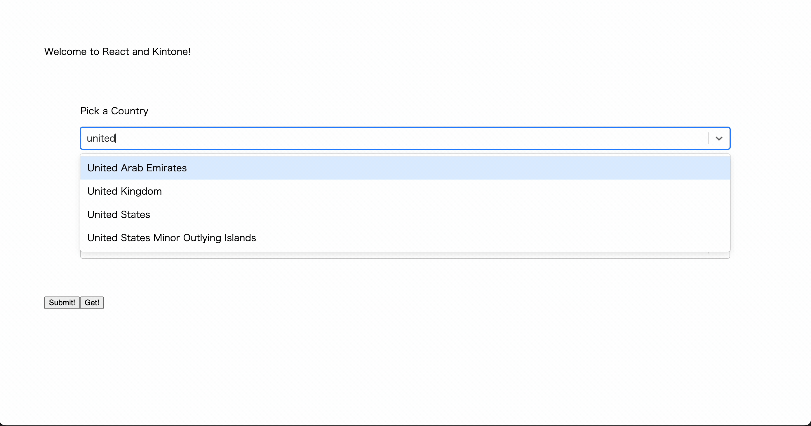
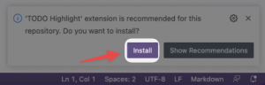

# JavaScript Workshop - Build a React App Using Web Database

---


Let's create a front-end React Component that exchanges the contents of a 3rd party Web Database service using Express as a proxy.

## Outline <!-- omit in toc -->
* [Completed Project](#completed-project)
* [Get Started](#get-started)
  * [Terminal 1](#terminal-1)
  * [Terminal 2](#terminal-2)
* [Get Your Free Kintone Database](#get-your-free-kintone-database)
* [Workshop Steps](#workshop-steps)
* [Debugging](#debugging)
  * [`npm install` command is not working](#npm-install-command-is-not-working)
  * [Errors related to .env](#errors-related-to-env)
  * [Errors related to Node.js \& npm](#errors-related-to-nodejs--npm)
  * [Express Server inside backend folder not working?](#express-server-inside-backend-folder-not-working)
  * [Not seeing a highlighted `TODO:`?](#not-seeing-a-highlighted-todo)
* [Completed Code](#completed-code)
* [Overview of the Repo](#overview-of-the-repo)

## Completed Project


## Get Started
_Clone the Repo & Install Dependencies_ 💪

First, clone the [kintone-workshops/React-x-REST-API-Workshop](https://github.com/kintone-workshops/React-x-REST-API-Workshop) repo!  🚀  
Then go inside the folders & install the dependencies!

⚡ Two terminal windows are required for this workshop.

### Terminal 1

```shell
cd Downloads

git clone https://github.com/kintone-workshops/React-x-REST-API-Workshop

cd React-x-REST-API-Workshop

npm install
```

### Terminal 2

```shell
cd Downloads/React-x-REST-API-Workshop

cd backend && npm install
```

### ⚠️ WARNING ⚠️ <!-- omit in toc -->
⚡ **Node.js v18.16.1** or higher is required to run this workshop.  
(The current LTS version is recommended)

For more information, refer to the [Guide on Installing Node.js & npm {macOS & Windows}](https://dev.to/kintonedevprogram/guide-on-installing-nodejs-npm-macos-windows-16ii).

Open the `React-x-REST-API-Workshop` folder in [VS Code](https://code.visualstudio.com/docs/getstarted/tips-and-tricks#_command-line) as well:

```shell
code .
```

## Get Your Free Kintone Database

[kintone.dev/new/](http://kintone.dev/new/)
* ⚡ Only use lowercase, numbers, & hyphens in your subdomain
* ⚠ Do not use uppercase or special characters

|                                                                                                               |                                                                                                                                 |
| ------------------------------------------------------------------------------------------------------------- | ------------------------------------------------------------------------------------------------------------------------------- |
|          |  |
|  |                                                               |

For more information, check out the [Workshop_Steps.md > B. Get Your Free Kintone Database](./docs/Workshop_Steps.md#b-get-your-free-kintone-database) section!

---

## Workshop Steps

1. [A. Get started - clone the repo \& install dependencies](./docs/Workshop_Steps.md#a-get-started---clone-the-repo--install-dependencies)
1. [B. Get your free Kintone database](./docs/Workshop_Steps.md#b-get-your-free-kintone-database)
1. [C. Create a `.env` file](./docs/Workshop_Steps.md#c-create-a-env-file)
1. [D. Create a Kintone web database app](./docs/Workshop_Steps.md#d-create-a-kintone-web-database-app)
1. [E. Generate an API token for the Kintone app](./docs/Workshop_Steps.md#e-generate-an-api-token-for-the-kintone-app)
1. [H. Edit server.js](./docs/Workshop_Steps.md#h-edit-serverjs)
1. [I. Start the servers](./docs/Workshop_Steps.md#i-start-the-servers)

---

---

## Debugging
**Let's Fix Those Problems** 💪

Here is a rundown of common problems that may occur & their solutions!

### `npm install` command is not working

1. Verify the Node.js & npm versions **inside** the `React-x-REST-API-Workshop` folder
2. Just installed Node.js? Verify you configured Node.js versions **inside** the `React-x-REST-API-Workshop` folder

* Mac:`nodenv install 18.16.1 && nodenv local 18.16.1`
* Windows: `nvm install 18.16.1 && nvm use 18.16.1`

Not the correct versions, or confused? 🤔 → Check out the [Guide on Installing Node.js & npm {macOS & Windows}](https://dev.to/kintonedevprogram/guide-on-installing-nodejs-npm-macos-windows-16ii).

### Errors related to .env

If you get one of the following error messages:  

* `[webpack-cli] Error: Missing environment variable: KINTONE_BASE_URL`
* `[webpack-cli] Error: Missing environment variable: KINTONE_PASSWORD`
* `[webpack-cli] Error: Missing environment variable: KINTONE_USERNAME`
* `[webpack-cli] Error: Missing environment variable: VIEW_ID`
* `[webpack-cli] TypeError: Cannot convert undefined or null to object`
* `Failed to find .env file at default paths: [./.env,./.env.js,./.env.json]`
* `Failed to find .env file at default paths: [./.env,./.env.js,./.env.json]`
* `Failed to upload JavaScript/CSS files`
* `KintoneRestAPIError: [520] [CB_WA01] Password authentication failed...`

Then please verify that
* your `.env` file has been correctly configured
* your username and password for your Kintone account are correct
* you have not modified the `.env.example`

### Errors related to Node.js & npm

Error Message:

```shell
❯ npm run start

> react-x-rest-api-workshop@1.0.0 start
> react-scripts start

sh: react-scripts: command not found
```

Solution:

```shell
cd React-x-REST-API-Workshop
npm install
```

### Express Server inside backend folder not working?

Inside `backend` folder and trying to execute `npm run start` command

Error Message:

```shell
> backend@1.0.0 start
> nodemon --watch .env --watch ../frontend server.js

[nodemon] 2.0.22
[nodemon] to restart at any time, enter `rs`
[nodemon] watching path(s): .env ../frontend
[nodemon] watching extensions: js,mjs,json
[nodemon] starting `node server.js`
node:events:491
      throw er; // Unhandled 'error' event
      ^

Error: listen EADDRINUSE: address already in use :::50000
    at Server.setupListenHandle [as _listen2] (node:net:1740:16)
    at listenInCluster (node:net:1788:12)
    at Server.listen (node:net:1876:7)
    at Function.listen (/Users/username/Downloads/React-x-REST-API-Workshop/backend/node_modules/express/lib/application.js:635:24)
    at Object.<anonymous> (/Users/username/Downloads/React-x-REST-API-Workshop/backend/server.js:78:5)
    at Module._compile (node:internal/modules/cjs/loader:1254:14)
    at Module._extensions..js (node:internal/modules/cjs/loader:1308:10)
    at Module.load (node:internal/modules/cjs/loader:1117:32)
    at Module._load (node:internal/modules/cjs/loader:958:12)
    at Function.executeUserEntryPoint [as runMain] (node:internal/modules/run_main:81:12)
Emitted 'error' event on Server instance at:
    at emitErrorNT (node:net:1767:8)
    at process.processTicksAndRejections (node:internal/process/task_queues:82:21) {
  code: 'EADDRINUSE',
  errno: -48,
  syscall: 'listen',
  address: '::',
  port: 50000
}

Node.js v18.16.1
[nodemon] app crashed - waiting for file changes before starting...
```

Solution:  
The important line is `Error: listen EADDRINUSE: address already in use :::50000`.  
This means that the port 50000 is already in use.

Restart the terminal and try again.  

If the error persists, let's kill the process that is using port 50000 manually.

```shell
# Find the process that is using port 50000
lsof -i tcp:50000
# Kill the process
kill -9 <PID>
```

For more information, refer to the [How to kill server when seeing "EADDRINUSE: address already in use" post by B. Chen](https://levelup.gitconnected.com/how-to-kill-server-when-seeing-eaddrinuse-address-already-in-use-16c4c4d7fe5d).

### Not seeing a highlighted `TODO:`?
Click the `Install` button on the VS Code pop-up message to install [TODO Highlight extension](https://marketplace.visualstudio.com/items?itemName=wayou.vscode-todo-highlight).
* [](./docs/img/common_vscode/vscode-setting-extension-HD.png)  

---

## Completed Code
If you want the completed code for the index.js file, you can find it here:  
[Solution_server.js](./docs/Solution_server.js)

---

## Overview of the Repo

<details>
  <summary> ↯ Overview of the Repo ↯ </summary>

| File                                               | Purpose                                                                   | Need to Modify?        |
| -------------------------------------------------- | ------------------------------------------------------------------------- | ---------------------- |
| [package.json](package.json)                       | Project's metadata & scripts for building and uploading the customization |                        |
| [.env.example](.env.example)                       | The template for the .env file                                            |                        |
| [.env](.env)                                       | Holds the Kintone login credential and View ID                            | Yes! - Create it       |
|                                                    |                                                                           |                        |
| [./backend/server.js](./backend/server.js)         | Express server that handles the Kintone API requests                      | Yes! Complete the code |
|                                                    |                                                                           |                        |
| [docs/Workshop_Steps.md](./docs/Workshop_Steps.md) | Step-by-step guide that we do during the workshop                         |                        |

</details>
